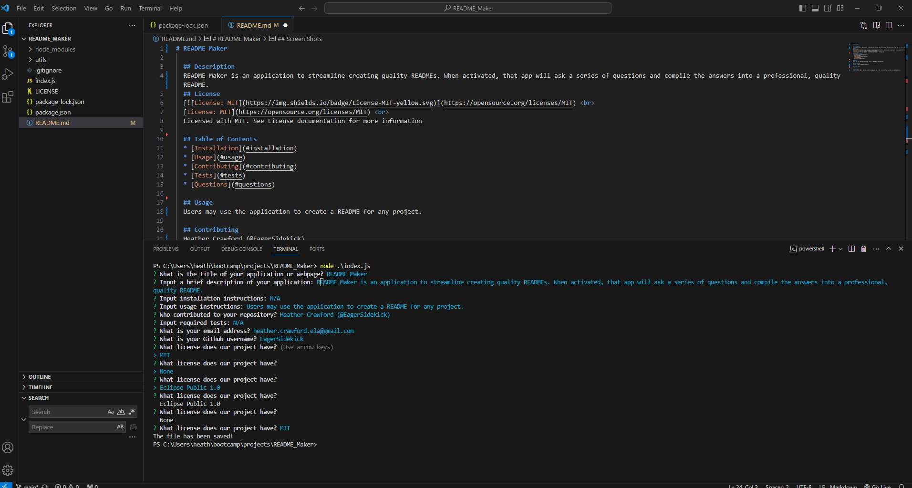

# README Maker

  ## Description
  README Maker is an application to streamline creating quality READMEs. When activated, that app will ask a series of questions and compile the answers into a professional, quality README.
  ## License
    
  [License: MIT](https://opensource.org/licenses/MIT)  
  Licensed with MIT. See License documentation for more information

  ## Table of Contents
  * [Installation](#installation)
  * [Usage](#usage)
  * [Contributing](#contributing)
  * [Tests](#tests)
  * [Questions](#questions)
  
  ## Usage
  Users may use the application to create a README for any project.

  ## Contributing
  Heather Crawford (@EagerSidekick)

  ## Screen Shots
  

  ## Questions
  Please contact me at heather.crawford.ela@gmail.com or at [Github](https://github.com/EagerSidekick).
